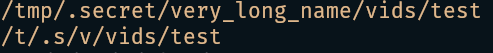

# spwd
Print the current working directory in a shortened format

## Installation

To install spwd simply download the latest binary from the [releases](https://github.com/em-s-h/spwd/releases)
page, make it executable, and add it to your PATH.

## Building from source

To build spwd from source simply clone the repository `git clone git@github.com:em-s-h/spwd.git`,
and inside the repository run `cargo b -r`;
